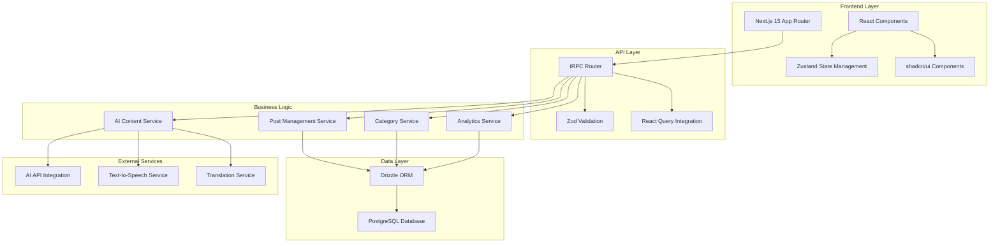
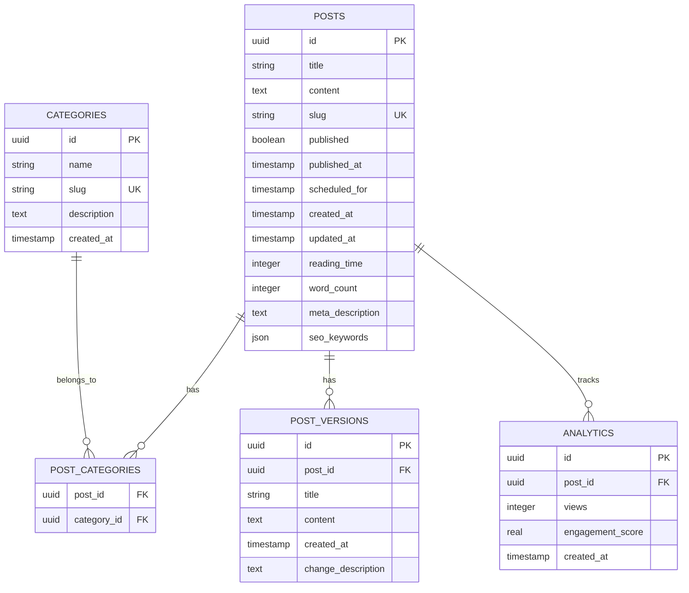
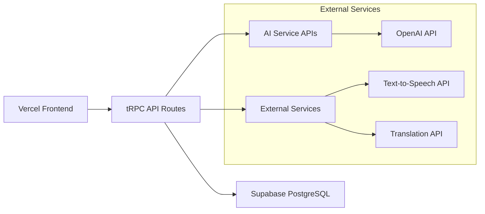

# Design Document - Multi-User Blogging Platform

## Overview

The Multi-User Blogging Platform is a modern, full-stack application built with Next.js 15 that provides comprehensive blog management capabilities with extraordinary features like AI-assisted content creation, real-time collaboration, and personalized reader experiences. The platform emphasizes type safety, performance, and clean architecture while delivering a simple yet powerful user interface.

## Architecture

### High-Level Architecture



### Folder Structure

```
src/
├── app/                          # Next.js 15 App Router
│   ├── (dashboard)/             # Dashboard route group
│   │   ├── dashboard/
│   │   └── layout.tsx
│   ├── blog/                    # Blog routes
│   │   ├── [slug]/
│   │   └── page.tsx
│   ├── category/                # Category routes
│   │   └── [slug]/
│   ├── globals.css
│   ├── layout.tsx
│   └── page.tsx                 # Landing page
├── components/                  # Reusable UI components
│   ├── ui/                      # shadcn/ui components
│   ├── blog/                    # Blog-specific components
│   ├── dashboard/               # Dashboard components
│   ├── forms/                   # Form components
│   └── layout/                  # Layout components
├── lib/                         # Utility libraries
│   ├── db/                      # Database configuration
│   ├── trpc/                    # tRPC configuration
│   ├── ai/                      # AI service integrations
│   ├── utils.ts                 # General utilities
│   └── validations.ts           # Zod schemas
├── server/                      # Server-side code
│   ├── api/                     # tRPC routers
│   │   ├── routers/
│   │   │   ├── posts.ts
│   │   │   ├── categories.ts
│   │   │   ├── ai.ts
│   │   │   └── analytics.ts
│   │   ├── root.ts
│   │   └── trpc.ts
│   └── db/                      # Database schema and migrations
│       ├── schema.ts
│       └── migrations/
├── stores/                      # Zustand stores
│   ├── usePostStore.ts
│   ├── useUIStore.ts
│   └── useUserPreferences.ts
└── types/                       # TypeScript type definitions
    ├── blog.ts
    ├── api.ts
    └── ui.ts
```

## Components and Interfaces

### Core Components

#### 1. Layout Components

- **MainLayout**: Primary application layout with navigation
- **DashboardLayout**: Dashboard-specific layout with sidebar
- **BlogLayout**: Blog content layout with reading optimizations

#### 2. Blog Components

- **PostEditor**: Markdown editor with live preview and AI assistance
- **PostCard**: Reusable post preview component
- **PostList**: Paginated list of posts with filtering
- **PostView**: Individual post display with reading features
- **CategoryFilter**: Category selection and filtering interface

#### 3. Dashboard Components

- **PostManager**: Comprehensive post management interface
- **CategoryManager**: Category CRUD operations
- **AnalyticsDashboard**: Content performance metrics
- **BulkActions**: Multi-select operations for posts

#### 4. AI-Enhanced Components

- **AIAssistant**: Content suggestions and optimization
- **VersionHistory**: Post revision tracking and restoration
- **CollaborativeEditor**: Real-time editing capabilities
- **ContentScheduler**: Post scheduling interface

### Key Interfaces

```typescript
// Core Blog Types
interface BlogPost {
  id: string;
  title: string;
  content: string;
  slug: string;
  published: boolean;
  publishedAt?: Date;
  scheduledFor?: Date;
  createdAt: Date;
  updatedAt: Date;
  readingTime: number;
  wordCount: number;
  metaDescription?: string;
  seoKeywords: string[];
  categories: Category[];
  versions: PostVersion[];
}

interface Category {
  id: string;
  name: string;
  slug: string;
  description?: string;
  postCount: number;
  createdAt: Date;
}

interface PostVersion {
  id: string;
  postId: string;
  content: string;
  title: string;
  createdAt: Date;
  changeDescription?: string;
}

// AI Integration Types
interface AIContentSuggestion {
  type: "title" | "meta" | "keywords" | "category";
  suggestions: string[];
  confidence: number;
}

interface ContentAnalytics {
  postId: string;
  views: number;
  readingTime: number;
  engagementScore: number;
  popularCategories: string[];
}

// User Preferences
interface UserPreferences {
  theme: "light" | "dark";
  readingMode: "normal" | "focus";
  language: string;
  audioEnabled: boolean;
  collaborationEnabled: boolean;
}
```

## Data Models

### Database Schema (Drizzle ORM)

```typescript
// Posts Table
export const posts = pgTable("posts", {
  id: uuid("id").defaultRandom().primaryKey(),
  title: varchar("title", { length: 255 }).notNull(),
  content: text("content").notNull(),
  slug: varchar("slug", { length: 255 }).notNull().unique(),
  published: boolean("published").default(false),
  publishedAt: timestamp("published_at"),
  scheduledFor: timestamp("scheduled_for"),
  createdAt: timestamp("created_at").defaultNow(),
  updatedAt: timestamp("updated_at").defaultNow(),
  readingTime: integer("reading_time").default(0),
  wordCount: integer("word_count").default(0),
  metaDescription: text("meta_description"),
  seoKeywords: json("seo_keywords").$type<string[]>().default([]),
});

// Categories Table
export const categories = pgTable("categories", {
  id: uuid("id").defaultRandom().primaryKey(),
  name: varchar("name", { length: 100 }).notNull(),
  slug: varchar("slug", { length: 100 }).notNull().unique(),
  description: text("description"),
  createdAt: timestamp("created_at").defaultNow(),
});

// Post-Category Junction Table
export const postCategories = pgTable(
  "post_categories",
  {
    postId: uuid("post_id").references(() => posts.id, { onDelete: "cascade" }),
    categoryId: uuid("category_id").references(() => categories.id, {
      onDelete: "cascade",
    }),
  },
  (table) => ({
    pk: primaryKey({ columns: [table.postId, table.categoryId] }),
  })
);

// Post Versions Table
export const postVersions = pgTable("post_versions", {
  id: uuid("id").defaultRandom().primaryKey(),
  postId: uuid("post_id").references(() => posts.id, { onDelete: "cascade" }),
  title: varchar("title", { length: 255 }).notNull(),
  content: text("content").notNull(),
  createdAt: timestamp("created_at").defaultNow(),
  changeDescription: text("change_description"),
});

// Analytics Table
export const analytics = pgTable("analytics", {
  id: uuid("id").defaultRandom().primaryKey(),
  postId: uuid("post_id").references(() => posts.id, { onDelete: "cascade" }),
  views: integer("views").default(0),
  engagementScore: real("engagement_score").default(0),
  createdAt: timestamp("created_at").defaultNow(),
});
```

### Relationships



## Error Handling

### Error Handling Strategy

#### 1. tRPC Error Handling

```typescript
// Custom error types
export class BlogError extends Error {
  constructor(
    message: string,
    public code:
      | "NOT_FOUND"
      | "VALIDATION_ERROR"
      | "UNAUTHORIZED"
      | "INTERNAL_ERROR",
    public statusCode: number = 500
  ) {
    super(message);
  }
}

// tRPC error middleware
export const errorMiddleware = t.middleware(async ({ next }) => {
  try {
    return await next();
  } catch (error) {
    if (error instanceof BlogError) {
      throw new TRPCError({
        code: error.code === "NOT_FOUND" ? "NOT_FOUND" : "BAD_REQUEST",
        message: error.message,
      });
    }
    throw new TRPCError({
      code: "INTERNAL_SERVER_ERROR",
      message: "An unexpected error occurred",
    });
  }
});
```

#### 2. Frontend Error Boundaries

```typescript
// Global error boundary for React components
export class BlogErrorBoundary extends Component<Props, State> {
  constructor(props: Props) {
    super(props);
    this.state = { hasError: false, error: null };
  }

  static getDerivedStateFromError(error: Error): State {
    return { hasError: true, error };
  }

  componentDidCatch(error: Error, errorInfo: ErrorInfo) {
    console.error("Blog error:", error, errorInfo);
    // Log to external service in production
  }

  render() {
    if (this.state.hasError) {
      return <ErrorFallback error={this.state.error} />;
    }
    return this.props.children;
  }
}
```

#### 3. Form Validation Errors

```typescript
// Zod schema with custom error messages
export const createPostSchema = z.object({
  title: z
    .string()
    .min(1, "Title is required")
    .max(255, "Title must be less than 255 characters"),
  content: z.string().min(10, "Content must be at least 10 characters"),
  categories: z
    .array(z.string().uuid())
    .min(1, "At least one category is required"),
  published: z.boolean().default(false),
  scheduledFor: z.date().optional(),
});
```

## Testing Strategy

_Note: As per requirements, no testing implementation is included in this project. This section is provided for architectural completeness but will not be implemented._

### Testing Architecture Overview

- **Unit Tests**: Component and utility function testing
- **Integration Tests**: API endpoint and database operation testing
- **E2E Tests**: Full user workflow testing
- **Performance Tests**: Load and stress testing for content operations

_Testing implementation is explicitly excluded from this project scope._

## API Design (tRPC Routers)

### Posts Router

```typescript
export const postsRouter = createTRPCRouter({
  // Core CRUD operations
  create: publicProcedure
    .input(createPostSchema)
    .mutation(async ({ input, ctx }) => {
      const slug = generateSlug(input.title);
      const readingTime = calculateReadingTime(input.content);
      const wordCount = countWords(input.content);

      return ctx.db.insert(posts).values({
        ...input,
        slug,
        readingTime,
        wordCount,
      });
    }),

  getAll: publicProcedure
    .input(
      z.object({
        published: z.boolean().optional(),
        categoryId: z.string().uuid().optional(),
        limit: z.number().min(1).max(100).default(10),
        offset: z.number().min(0).default(0),
      })
    )
    .query(async ({ input, ctx }) => {
      return ctx.db.query.posts.findMany({
        where: and(
          input.published ? eq(posts.published, true) : undefined,
          input.categoryId
            ? exists(
                ctx.db
                  .select()
                  .from(postCategories)
                  .where(
                    and(
                      eq(postCategories.postId, posts.id),
                      eq(postCategories.categoryId, input.categoryId)
                    )
                  )
              )
            : undefined
        ),
        with: { categories: true },
        limit: input.limit,
        offset: input.offset,
        orderBy: desc(posts.createdAt),
      });
    }),

  getBySlug: publicProcedure
    .input(z.object({ slug: z.string() }))
    .query(async ({ input, ctx }) => {
      const post = await ctx.db.query.posts.findFirst({
        where: eq(posts.slug, input.slug),
        with: { categories: true, versions: true },
      });

      if (!post) {
        throw new TRPCError({
          code: "NOT_FOUND",
          message: "Post not found",
        });
      }

      return post;
    }),

  update: publicProcedure
    .input(updatePostSchema)
    .mutation(async ({ input, ctx }) => {
      const { id, ...updateData } = input;

      // Create version history entry
      const currentPost = await ctx.db.query.posts.findFirst({
        where: eq(posts.id, id),
      });

      if (currentPost) {
        await ctx.db.insert(postVersions).values({
          postId: id,
          title: currentPost.title,
          content: currentPost.content,
          changeDescription: "Auto-saved version",
        });
      }

      return ctx.db
        .update(posts)
        .set({
          ...updateData,
          updatedAt: new Date(),
          readingTime: updateData.content
            ? calculateReadingTime(updateData.content)
            : undefined,
          wordCount: updateData.content
            ? countWords(updateData.content)
            : undefined,
        })
        .where(eq(posts.id, id));
    }),

  delete: publicProcedure
    .input(z.object({ id: z.string().uuid() }))
    .mutation(async ({ input, ctx }) => {
      return ctx.db.delete(posts).where(eq(posts.id, input.id));
    }),

  // Advanced features
  schedule: publicProcedure
    .input(
      z.object({
        id: z.string().uuid(),
        scheduledFor: z.date(),
      })
    )
    .mutation(async ({ input, ctx }) => {
      return ctx.db
        .update(posts)
        .set({ scheduledFor: input.scheduledFor })
        .where(eq(posts.id, input.id));
    }),

  bulkUpdateCategories: publicProcedure
    .input(
      z.object({
        postIds: z.array(z.string().uuid()),
        categoryIds: z.array(z.string().uuid()),
      })
    )
    .mutation(async ({ input, ctx }) => {
      // Remove existing categories for these posts
      await ctx.db
        .delete(postCategories)
        .where(inArray(postCategories.postId, input.postIds));

      // Add new categories
      const insertData = input.postIds.flatMap((postId) =>
        input.categoryIds.map((categoryId) => ({ postId, categoryId }))
      );

      return ctx.db.insert(postCategories).values(insertData);
    }),

  search: publicProcedure
    .input(
      z.object({
        query: z.string().min(1),
        limit: z.number().min(1).max(50).default(10),
      })
    )
    .query(async ({ input, ctx }) => {
      return ctx.db.query.posts.findMany({
        where: or(
          ilike(posts.title, `%${input.query}%`),
          ilike(posts.content, `%${input.query}%`)
        ),
        with: { categories: true },
        limit: input.limit,
        orderBy: desc(posts.createdAt),
      });
    }),
});
```

### AI Router

```typescript
export const aiRouter = createTRPCRouter({
  generateTitleSuggestions: publicProcedure
    .input(z.object({ content: z.string() }))
    .mutation(async ({ input }) => {
      // Integration with AI service for title suggestions
      const suggestions = await aiService.generateTitles(input.content);
      return { suggestions };
    }),

  generateSEOKeywords: publicProcedure
    .input(z.object({ title: z.string(), content: z.string() }))
    .mutation(async ({ input }) => {
      const keywords = await aiService.extractKeywords(
        input.title,
        input.content
      );
      return { keywords };
    }),

  generateMetaDescription: publicProcedure
    .input(z.object({ title: z.string(), content: z.string() }))
    .mutation(async ({ input }) => {
      const metaDescription = await aiService.generateMetaDescription(
        input.title,
        input.content
      );
      return { metaDescription };
    }),

  suggestCategories: publicProcedure
    .input(z.object({ title: z.string(), content: z.string() }))
    .query(async ({ input, ctx }) => {
      const existingCategories = await ctx.db.query.categories.findMany();
      const suggestions = await aiService.suggestCategories(
        input.title,
        input.content,
        existingCategories
      );
      return { suggestions };
    }),
});
```

## State Management (Zustand)

### Post Management Store

```typescript
interface PostStore {
  posts: BlogPost[];
  currentPost: BlogPost | null;
  isLoading: boolean;
  error: string | null;

  // Actions
  setPosts: (posts: BlogPost[]) => void;
  setCurrentPost: (post: BlogPost | null) => void;
  addPost: (post: BlogPost) => void;
  updatePost: (id: string, updates: Partial<BlogPost>) => void;
  removePost: (id: string) => void;
  setLoading: (loading: boolean) => void;
  setError: (error: string | null) => void;
}

export const usePostStore = create<PostStore>((set, get) => ({
  posts: [],
  currentPost: null,
  isLoading: false,
  error: null,

  setPosts: (posts) => set({ posts }),
  setCurrentPost: (post) => set({ currentPost: post }),

  addPost: (post) =>
    set((state) => ({
      posts: [post, ...state.posts],
    })),

  updatePost: (id, updates) =>
    set((state) => ({
      posts: state.posts.map((post) =>
        post.id === id ? { ...post, ...updates } : post
      ),
      currentPost:
        state.currentPost?.id === id
          ? { ...state.currentPost, ...updates }
          : state.currentPost,
    })),

  removePost: (id) =>
    set((state) => ({
      posts: state.posts.filter((post) => post.id !== id),
      currentPost: state.currentPost?.id === id ? null : state.currentPost,
    })),

  setLoading: (isLoading) => set({ isLoading }),
  setError: (error) => set({ error }),
}));
```

### UI Preferences Store

```typescript
interface UIStore {
  theme: "light" | "dark";
  readingMode: "normal" | "focus";
  sidebarCollapsed: boolean;
  language: string;
  audioEnabled: boolean;

  // Actions
  setTheme: (theme: "light" | "dark") => void;
  setReadingMode: (mode: "normal" | "focus") => void;
  toggleSidebar: () => void;
  setLanguage: (language: string) => void;
  toggleAudio: () => void;
}

export const useUIStore = create<UIStore>()(
  persist(
    (set) => ({
      theme: "light",
      readingMode: "normal",
      sidebarCollapsed: false,
      language: "en",
      audioEnabled: false,

      setTheme: (theme) => set({ theme }),
      setReadingMode: (readingMode) => set({ readingMode }),
      toggleSidebar: () =>
        set((state) => ({
          sidebarCollapsed: !state.sidebarCollapsed,
        })),
      setLanguage: (language) => set({ language }),
      toggleAudio: () =>
        set((state) => ({
          audioEnabled: !state.audioEnabled,
        })),
    }),
    {
      name: "ui-preferences",
    }
  )
);
```

## Performance Optimizations

### 1. React Query Caching Strategy

```typescript
// Optimized query keys and caching
export const postQueries = {
  all: ["posts"] as const,
  lists: () => [...postQueries.all, "list"] as const,
  list: (filters: PostFilters) => [...postQueries.lists(), filters] as const,
  details: () => [...postQueries.all, "detail"] as const,
  detail: (slug: string) => [...postQueries.details(), slug] as const,
};

// Pre-fetch related content
export const usePrefetchRelatedPosts = (categoryIds: string[]) => {
  const utils = api.useUtils();

  useEffect(() => {
    categoryIds.forEach((categoryId) => {
      utils.posts.getAll.prefetch({ categoryId, limit: 5 });
    });
  }, [categoryIds, utils]);
};
```

### 2. Optimistic Updates

```typescript
// Optimistic post updates
export const useOptimisticPostUpdate = () => {
  const utils = api.useUtils();

  return api.posts.update.useMutation({
    onMutate: async (newPost) => {
      await utils.posts.getAll.cancel();

      const previousPosts = utils.posts.getAll.getData();

      utils.posts.getAll.setData(undefined, (old) =>
        old?.map((post) =>
          post.id === newPost.id ? { ...post, ...newPost } : post
        )
      );

      return { previousPosts };
    },

    onError: (err, newPost, context) => {
      utils.posts.getAll.setData(undefined, context?.previousPosts);
    },

    onSettled: () => {
      utils.posts.getAll.invalidate();
    },
  });
};
```

### 3. Component Optimization

```typescript
// Memoized components for performance
export const PostCard = memo(({ post }: { post: BlogPost }) => {
  const formattedDate = useMemo(
    () => formatDate(post.createdAt),
    [post.createdAt]
  );

  return (
    <Card className="hover:shadow-lg transition-shadow">
      <CardHeader>
        <CardTitle>{post.title}</CardTitle>
        <CardDescription>{formattedDate}</CardDescription>
      </CardHeader>
      <CardContent>
        <p className="line-clamp-3">{post.content}</p>
        <div className="flex gap-2 mt-2">
          {post.categories.map((category) => (
            <Badge key={category.id} variant="secondary">
              {category.name}
            </Badge>
          ))}
        </div>
      </CardContent>
    </Card>
  );
});
```

## Security Considerations

### 1. Input Validation

- All user inputs validated through Zod schemas
- SQL injection prevention through Drizzle ORM parameterized queries
- XSS prevention through proper content sanitization

### 2. Content Security

- Markdown content sanitization before rendering
- File upload restrictions and validation
- Rate limiting on API endpoints

### 3. Data Protection

- Environment variable management for sensitive data
- Database connection security
- Proper error message handling to prevent information leakage

## Deployment Architecture

### Production Setup



### Environment Configuration

```typescript
// Environment variables structure
interface Environment {
  DATABASE_URL: string;
  NEXTAUTH_SECRET: string;
  OPENAI_API_KEY: string;
  NEXT_PUBLIC_APP_URL: string;
  TEXT_TO_SPEECH_API_KEY: string;
  TRANSLATION_API_KEY: string;
}
```

This design provides a comprehensive architecture for the blogging platform that emphasizes type safety, performance, and extraordinary features while maintaining clean code organization and scalability.

## AI Implementation Details (Google Gemini Integration)

### Where AI Features Are Implemented:

#### 1. **Post Editor Interface** (`src/components/blog/PostEditor.tsx`)

- **Real-time title suggestions** as user types content
- **SEO optimization panel** with keyword and meta description generation
- **Writing assistance** with content improvement suggestions
- **Category auto-suggestions** based on content analysis

#### 2. **AI Service Layer** (`src/lib/ai/gemini-service.ts`)

```typescript
export class GeminiAIService {
  private apiKey: string;
  private baseURL = "https://generativelanguage.googleapis.com/v1beta";

  async generateTitleSuggestions(content: string): Promise<string[]> {
    // Analyze content and generate 5 compelling title options
  }

  async generateSEOKeywords(title: string, content: string): Promise<string[]> {
    // Extract relevant SEO keywords from content
  }

  async generateMetaDescription(
    title: string,
    content: string
  ): Promise<string> {
    // Create SEO-optimized meta description (150-160 chars)
  }

  async suggestCategories(
    content: string,
    existingCategories: Category[]
  ): Promise<string[]> {
    // Analyze content and suggest matching categories
  }

  async optimizeContent(content: string): Promise<ContentOptimization> {
    // Provide writing improvement suggestions
  }
}
```

#### 3. **tRPC AI Router** (`src/server/api/routers/ai.ts`)

- **API endpoints** for all AI features with proper error handling
- **Rate limiting** and caching to optimize Gemini API usage
- **Input validation** with Zod schemas for AI requests

#### 4. **Dashboard Analytics** (`src/components/dashboard/AIInsights.tsx`)

- **Content performance analysis** using AI-powered insights
- **Writing improvement suggestions** based on content analysis
- **Trending topic recommendations** for future posts

### AI Features in User Interface:

#### **Post Creation Flow:**

1. **Content Analysis**: User starts typing → AI analyzes content in real-time
2. **Title Suggestions**: AI provides 5 title options based on content
3. **SEO Optimization**: AI generates keywords and meta descriptions
4. **Category Matching**: AI suggests relevant categories from existing ones
5. **Content Enhancement**: AI provides writing improvement tips

#### **Dashboard Integration:**

- **AI Insights Panel**: Shows content optimization suggestions for all posts
- **Smart Categories**: AI-powered category management and suggestions
- **Content Analytics**: AI-driven performance insights and recommendations
- **Bulk Optimization**: AI analysis for multiple posts simultaneously

### Google Gemini API Configuration:

```typescript
// Environment variables for Gemini
interface AIEnvironment {
  GOOGLE_GEMINI_API_KEY: string;  // Free tier: 15 requests/minute
  GEMINI_MODEL: string;           // gemini-1.5-flash (fastest, free)
}

// API Usage Optimization:
- Cache AI responses for 24 hours to reduce API calls
- Batch requests when possible
- Implement fallback for API failures
- Rate limiting: Max 10 requests/minute per user
```

This AI integration provides extraordinary value while using Google Gemini's free tier efficiently!
